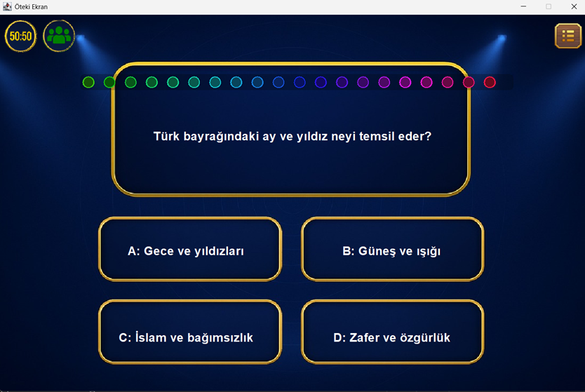
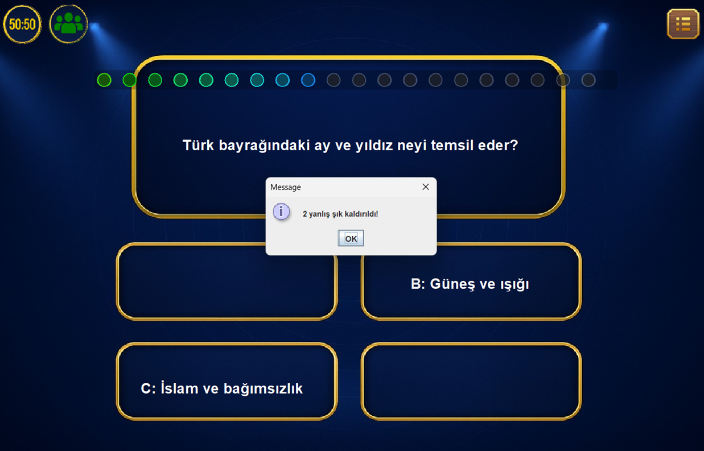
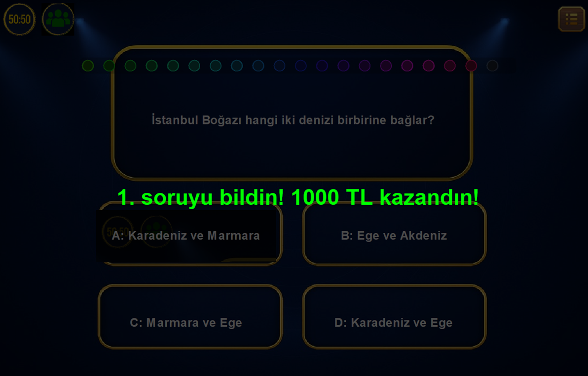
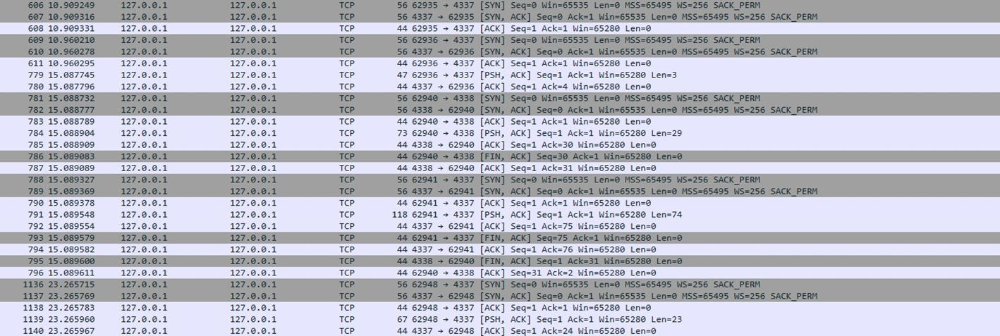

# 🎮 Who Wants To Be A Millionaire?

A desktop quiz game inspired by the famous TV show **“Who Wants to Be a Millionaire?”**, developed using **Java Swing** with a strong focus on modular architecture, user experience, and **TCP socket–based client-server communication**.

---

## 🚀 Features

- 🎯 Classic multiple-choice quiz system  
- 🃏 Lifelines  
  - **50:50**
  - **Ask the Audience**
- 🧠 Progressive difficulty & prize ladder system
- 🖥️ Modern and responsive Swing GUI
- 🌐 Firebase integration for persistent data
- 🔌 **TCP Socket–based client-server communication**
- ⚙️ Multithreaded background operations

---

## 🖼️ Game Screenshots

> Screenshots are placed in the repository and named sequentially  
> `1.png`, `2.png`, `3.png`, ...

### 1️⃣ Question Screen

### 2️⃣ 50:50 Lifeline in Action

### 3️⃣ Correct Answer Feedback

### 4️⃣ Elimination / Game Over Screen

### 5️⃣ Prize Ladder View

### 6️⃣ TCP Socket Communication (Ask the Audience)

---

## 🌐 TCP Socket Communication

The **Ask the Audience** lifeline is implemented using **TCP socket programming** to simulate a real client-server architecture.

- A dedicated socket server listens for incoming client requests
- The game client establishes a TCP connection when the lifeline is triggered
- Audience vote data is transferred over the socket connection
- Communication is handled asynchronously using **multithreading**
- This prevents UI freezing and ensures a smooth user experience

This approach demonstrates real-world networking concepts such as:
- TCP handshake
- Client-server data exchange
- Concurrent socket handling
- Error handling for connection failures

---

## 🛠️ Tech Stack

- **Programming Language:** Java  
- **GUI:** Java Swing  
- **Networking:** TCP Sockets (Java Socket API)  
- **Database:** Firebase Realtime Database  
- **IDE:** IntelliJ IDEA / Eclipse  
- **Platform:** Cross-platform (Windows, Linux, macOS)

---

## 🧩 Architecture Overview

- Object-oriented and modular design
- Each game feature encapsulated in separate classes
- Lifelines implemented via a common interface
- Thread-safe UI updates using `SwingUtilities.invokeLater()`
- Asynchronous TCP socket communication to avoid UI blocking

---

## 👨‍💻 Developer

**Sercan Özkan**

---

## 📌 Notes

- This project was developed for educational purposes  
- Designed to be easily extendable with new lifelines or question sets  

---

⭐ If you like the project, feel free to star the repository!
